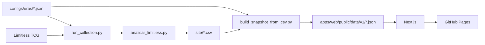

# SH Meta Games

Metagame público e diário competitivo local-first para **Pokémon TCG Standard
Online**. O projeto transforma resultados encerrados do
[Limitless TCG](https://play.limitlesstcg.com/) em rankings, perfis de
arquétipos e matchups direcionais, sem misturar esses dados públicos com o
histórico pessoal do jogador.

**Aplicação:** <https://samuelnahas.github.io/Limitless-stats/>

> O SH Meta Games é uma ferramenta estatística independente. Os resultados
> observados descrevem a amostra coletada; não garantem desempenho futuro nem
> substituem análise de formato, lista, pilotagem e tamanho da amostra.

## Escopo atual

O snapshot incluído no repositório cobre torneios **Standard**, **online** e
encerrados desde o início da era Pitch Black, em **16/07/2026**, sem corte
adicional de tamanho (mínimo de um jogador). O arquivo
[`configs/eras/standard-pitch-black.json`](configs/eras/standard-pitch-black.json)
é a fonte versionada para coleta e conversão; o frontend e novos eventos do
Journal recebem o escopo do [`manifest.json`](apps/web/public/data/v1/manifest.json).
Em uma rotação, ainda é necessário selecionar a nova configuração no workflow
e criar uma nova migration Supabase que encerre a temporada anterior e insira
a próxima com `seasons.slug` igual ao novo `eraId`. Não edite uma migration já
aplicada em ambientes provisionados.

O MVP inclui:

- panorama do metagame com presença, entradas, W-L-T, títulos e Top 8;
- catálogo pesquisável e detalhe dos arquétipos, com listas representativas;
- explorador e matriz de matchups para geral, MD1/BO1 e MD3/BO3;
- cinco políticas de cálculo para empates, aplicadas sem descartar o W-L-T;
- Battle Journal manual com parser de lista exportada pelo Pokémon TCG Live;
- armazenamento local e exportação JSON do histórico pessoal;
- autenticação por link de e-mail e sincronização manual opcional com Supabase;
- links somente leitura, revogáveis, para estatísticas pessoais agregadas.

Pokémon Pocket, feed social, importação automática do histórico pessoal e
recomendação garantida de deck não fazem parte do escopo atual. Veja o
[`docs/product-scope.md`](docs/product-scope.md) para a divisão P0/P1.

## Recursos e telas

| Tela | O que entrega |
| --- | --- |
| [Meta](https://samuelnahas.github.io/Limitless-stats/meta/) | Resumo do snapshot, decks que definem o campo, ranking e últimos torneios processados. |
| [Decks](https://samuelnahas.github.io/Limitless-stats/decks/) | Busca, ordenação, presença, desempenho, lista de 60 cartas e melhores/piores confrontos observados. |
| [Matchups](https://samuelnahas.github.io/Limitless-stats/matchups/) | Filtros por modalidade e amostra mínima, comparação direta e matriz direcional. |
| [Journal](https://samuelnahas.github.io/Limitless-stats/journal/) | Registro local, estatísticas pessoais, exportação, sincronização manual e links agregados revogáveis. |

A navegação é responsiva, com sidebar em telas amplas e barra inferior em
dispositivos móveis. As rotas públicas e os detalhes de deck podem ser
exportados estaticamente para o GitHub Pages.

## Início rápido

Pré-requisitos: **Node.js 20.9 ou superior**, **npm** e, para atualizar os
dados, **Python 3.12 ou superior**.

```bash
git clone https://github.com/SamuelNahas/Limitless-stats.git
cd Limitless-stats
npm --prefix apps/web ci
npm run dev
```

Acesse <http://localhost:3000>; a raiz renderiza o mesmo panorama disponível em
`/meta`. O frontend já usa o snapshot JSON versionado, portanto não é preciso
executar a coleta para desenvolver a interface.

Antes de abrir um pull request, execute:

```bash
npm run check
```

## Scripts

| Comando | Finalidade |
| --- | --- |
| `npm run dev` | Inicia o Next.js em modo de desenvolvimento. |
| `npm run build` | Gera o build de produção do frontend. |
| `npm run lint` | Executa o ESLint. |
| `npm run typecheck` | Gera os tipos de rotas do Next.js e valida o TypeScript. |
| `npm run test` | Executa a suíte Vitest uma vez. |
| `npm run check` | Roda lint, typecheck, testes e build, nessa ordem. |
| `npm run data:from-csv -- --input site --output apps/web/public/data/v1` | Converte os CSVs legados no contrato JSON v1. |
| `python3 scripts/run_collection.py --era-config <arquivo> --output site` | Executa o coletor com formato, período e mínimo definidos por uma era. |
| `npm --prefix apps/web run start` | Serve localmente um build Next.js não estático. |

Coleta completa usada na publicação:

```bash
python3 scripts/run_collection.py \
  --era-config configs/eras/standard-pitch-black.json \
  --output site

npm run data:from-csv -- \
  --input site \
  --output apps/web/public/data/v1 \
  --era-config configs/eras/standard-pitch-black.json
```

A coleta usa apenas a biblioteca padrão do Python, respeita um limitador local
de requisições e pode demorar sem uma chave da API. `LIMITLESS_API_KEY` é
opcional e deve ser fornecida somente ao processo do coletor. Acrescente
`--no-cache` apenas quando precisar forçar uma reconstrução fria.

## Estrutura do repositório

```text
.
├── .github/workflows/                # CI, coleta diária e deploy no Pages
├── apps/web/                         # Next.js App Router, React e TypeScript
│   ├── public/data/v1/               # snapshot público consumido pelo app
│   └── src/                          # rotas, componentes, domínio e testes
├── configs/eras/                     # escopo versionado de formato/rotação
├── docs/                             # escopo, modelo de dados e decisões
├── packages/contracts/schemas/       # JSON Schemas dos contratos de configuração
├── scripts/                           # runner configurável e conversor CSV -> JSON
├── supabase/migrations/              # schema, RLS, Auth e RPCs de compartilhamento
├── analisar_limitless.py             # coletor/analisador do Limitless
└── package.json                      # comandos de orquestração do monorepo
```

## Pipeline de dados públicos



1. O runner traduz a era ativa em argumentos do coletor, que lê torneios
   encerrados, listas e pareamentos públicos do Limitless e produz um relatório
   HTML mais CSVs auditáveis.
2. O conversor exige `decks.csv`, `matchups.csv`, `melhores_listas.csv` e
   `torneios.csv`; `decklists.csv` é opcional.
3. O conversor preserva contagens W/L/T e publica um snapshot imutável com
   `manifest.json`, decks, listas, torneios e matchups geral/MD1/MD3.
4. O frontend importa o contrato v1 em build time. Os dados pessoais do Journal
   nunca entram nesse pipeline.

Os JSONs de `public/data/v1` são artefatos gerados: altere a fonte ou o
conversor e regenere o snapshot, em vez de corrigir percentuais manualmente.
Detalhes do contrato estão em [`docs/data-model.md`](docs/data-model.md).

## Fórmulas e política de empates

O dado canônico é sempre o recorde bruto: `W` (vitórias), `L` (derrotas) e `T`
(empates). A interface calcula a taxa de resultado na leitura:

| Política | Fórmula |
| --- | --- |
| Ignorar empates | `W / (W + L)` |
| Empates como derrotas | `W / (W + L + T)` |
| Empates valem 1/2 vitória — padrão | `(W + T/2) / (W + L + T)` |
| Empates valem 1/3 vitória | `(W + T/3) / (W + L + T)` |
| Empates como vitórias | `(W + T) / (W + L + T)` |

Quando o denominador é zero, a taxa é exibida como indisponível. A preferência
é salva no navegador e também pode ser compartilhada pelo parâmetro `ties` da
URL. Matchups são direcionais, excluem espelhos nas comparações e exibem o
tamanho da amostra; associação observada não implica vantagem causal.

## Privacidade e estado do compartilhamento

| Capacidade | Estado atual |
| --- | --- |
| Journal em `localStorage` | Ativo e padrão. Torneios, listas, rodadas e notas ficam neste navegador até uma sincronização explícita. |
| Exportação do Journal | Ativa. Gera um arquivo JSON local em texto legível. |
| Login por e-mail | Ativo quando as variáveis e o provider de e-mail do Supabase são configurados. |
| Schema Supabase e RLS | Migration disponível; cada tabela pessoal é restrita ao proprietário. |
| Sincronização do Journal | Ativa, manual e bidirecional. O merge mantém a versão mais recente de cada torneio. |
| Exclusões sincronizadas | Uma exclusão local cria um tombstone e é aplicada na nuvem na próxima sincronização concluída. |
| Links revogáveis | Ativos. Compartilham nome do perfil e estatísticas agregadas na rota `/shared`; limite de dez links ativos. |

Sem conta, o modo local não transmite o Journal ao Supabase. Fazer login também
não inicia upload automático: os dados só são enviados ao escolher
**Sincronizar** ou **Compartilhar agregados**. A sincronização envia ao banco
privado nome e data do evento, texto completo da lista, rodadas, arquétipos,
ordem de jogo, placares e notas. O merge usa o `updatedAt` mais recente por
torneio — persistido como `client_updated_at`, separado do relógio de auditoria
do servidor —, atualiza o navegador e a nuvem e processa exclusões locais
pendentes.

Limpar os dados do navegador antes da primeira sincronização pode apagar o
histórico. Mantenha exportações privadas quando precisar de backup; o JSON
exportado contém listas, resultados e notas sem criptografia.

**Compartilhar agregados** sincroniza primeiro e cria uma URL bearer no formato
`/shared/?id=<id>#secret=<segredo>`. O segredo fica no fragmento e não é enviado
na requisição inicial ao GitHub Pages; o navegador o envia diretamente à RPC do
Supabase. O banco armazena apenas o hash. Qualquer pessoa com a URL completa
pode consultar o resumo até o link ser revogado.

O resumo mostra `display_name` — inicialmente “Treinador” —, política de
empate, número de eventos, W/L/T total e W/L/T agregado
por deck próprio e arquétipo adversário. Ele não inclui e-mail, eventos ou datas
individuais, notas, nomes de pessoas adversárias nem texto das listas. A UI
atual não define expiração automática; revogue manualmente os links que não
devem mais funcionar. A rota usa `noindex`, mas isso não substitui o segredo.

## Supabase e login por e-mail

O app público e o Journal local não exigem Supabase. Para habilitar o fluxo de
login existente:

1. Crie um projeto no [Supabase](https://supabase.com/dashboard) e copie a URL
   e a **publishable key** do painel *Connect*.
2. Copie o modelo de ambiente e preencha somente valores locais:

   ```bash
   cp .env.example apps/web/.env.local
   ```

3. No SQL Editor do Supabase, aplique
   [`supabase/migrations/202608030001_initial_schema.sql`](supabase/migrations/202608030001_initial_schema.sql).
   A migration cria o catálogo, o domínio pessoal, RLS, o perfil automático e
   as RPCs de compartilhamento.
4. No Supabase, mantenha **Authentication -> Providers -> Email** habilitado.
5. Em **Authentication -> URL Configuration**, defina a Site URL e autorize os
   callbacks do app:
   `http://localhost:3000/auth/callback/` e, em produção,
   `https://<host>/<base-path>/auth/callback/`.
6. Solicite o link na tela `/login` e abra a mensagem no mesmo navegador em que
   iniciou o acesso.

O serviço de e-mail embutido do Supabase é adequado somente para testes e envia
apenas para membros autorizados da organização, com limite reduzido. Para abrir
cadastro ao público, configure um provedor SMTP compatível em **Authentication
-> Emails -> SMTP Settings**.

Variáveis disponíveis:

| Variável | Uso |
| --- | --- |
| `NEXT_PUBLIC_SUPABASE_URL` | URL pública do projeto Supabase. |
| `NEXT_PUBLIC_SUPABASE_PUBLISHABLE_KEY` | Chave pública limitada por RLS; é enviada ao navegador. |
| `NEXT_PUBLIC_SITE_URL` | Origem canônica usada nos metadados; o workflow calcula a URL do Pages se estiver ausente. |
| `LIMITLESS_API_KEY` | Chave opcional do coletor Python; não é usada pelo frontend. |

Nunca exponha uma `service_role` ou chave `sb_secret_` no navegador, no Git ou
em variáveis `NEXT_PUBLIC_*`; use somente a chave `sb_publishable_`. Consulte os
guias oficiais de [login sem senha](https://supabase.com/docs/reference/javascript/auth-signinwithotp)
e [SMTP do Supabase](https://supabase.com/docs/guides/auth/auth-smtp).
O coletor Python não carrega `apps/web/.env.local`; forneça a chave Limitless no
ambiente do processo ou no secret `LIMITLESS_API_KEY` do GitHub Actions.

## Deploy sem infraestrutura paga

### GitHub Pages — caminho padrão

O workflow [`publicar-pages.yml`](.github/workflows/publicar-pages.yml) coleta
os dados, converte o snapshot, valida o frontend, gera o export estático com
`GITHUB_PAGES=true` e publica `apps/web/out`. Ele pode ser acionado manualmente,
em mudanças relevantes na `main` e diariamente às **06:17 UTC**. A
`LIMITLESS_API_KEY` pode ser cadastrada como secret do repositório, mas não é
obrigatória. O job restaura `.cache_limitless` entre execuções, reaproveitando
respostas anteriores e coletando incrementalmente o que ainda falta.

Em **Settings -> Pages**, selecione **GitHub Actions** como fonte. A URL padrão
será `https://<owner>.github.io/Limitless-stats/`. O deploy estático oferece
Meta, Decks, Matchups e Journal local sem servidor de aplicação.

Para ativar login, sincronização e links no Pages, cadastre em **Settings ->
Secrets and variables -> Actions -> Variables**:

- `NEXT_PUBLIC_SUPABASE_URL`;
- `NEXT_PUBLIC_SUPABASE_PUBLISHABLE_KEY`;
- `NEXT_PUBLIC_SITE_URL` opcionalmente — o workflow calcula
  `https://<owner>.github.io/<repo>` como fallback.

Esses valores são públicos por definição e são incorporados ao JavaScript. Sem
as duas variáveis do Supabase, o build continua funcional em modo local-only.
Depois de alterá-las, execute novamente o workflow de publicação.

Cada CSV da coleta fica disponível em
`/Limitless-stats/downloads/<arquivo>.csv`; não há uma página de índice nesse
caminho. Os mesmos arquivos também ficam no artifact `dados-limitless-csv` da
execução por 30 dias. O workflow
[`ci.yml`](.github/workflows/ci.yml) valida separadamente pull requests e pushes
na `main`, sem executar a coleta externa completa.

### Supabase Free e Vercel Hobby — opcionais

- Use o Supabase Free somente quando Auth/banco forem necessários; os snapshots
  públicos continuam como JSON estático para reduzir armazenamento e egress.
- Para Vercel, importe o repositório com `apps/web` como Root Directory, deixe
  `GITHUB_PAGES` indefinida e configure as três variáveis `NEXT_PUBLIC_*`.
- Um deploy direto da Vercel usa o snapshot já versionado; a coleta agendada
  continua sendo responsabilidade do GitHub Actions ou de outro job externo.

Planos e limites mudam. Confirme os termos atuais no
[GitHub Pages](https://docs.github.com/pages),
[Supabase Pricing](https://supabase.com/pricing) e
[Vercel Plans](https://vercel.com/docs/plans).

## Atribuições e aviso legal

- Dados competitivos e links de torneios/listas são derivados do
  [Limitless TCG](https://play.limitlesstcg.com/). Este projeto não é afiliado
  nem endossado pelo Limitless TCG.
- As artes exibidas nos cards não vêm da API `pokeapi.co`: o navegador as
  carrega em runtime de `raw.githubusercontent.com`, no repositório
  [PokeAPI/sprites](https://github.com/PokeAPI/sprites). Isso cria uma requisição
  de terceiros ao GitHub para cada asset ainda não armazenado em cache.
- A [licença do repositório de sprites](https://github.com/PokeAPI/sprites/blob/master/LICENCE.txt)
  identifica o conteúdo das imagens como copyright da The Pokémon Company. A
  declaração CC0 do repositório não elimina direitos de terceiros nem oferece
  garantia de titularidade; avalie direitos e cache local antes de redistribuir
  os assets.
- A [política de uso do PokéAPI](https://pokeapi.co/docs/v2#fairuse) solicita
  cache local dos recursos consumidos. O frontend atual ainda usa os URLs
  remotos diretamente.
- Pokémon, seus nomes, personagens e artes pertencem aos respectivos titulares,
  incluindo Nintendo, Creatures Inc., GAME FREAK inc. e The Pokémon Company.
  O SH Meta Games é um projeto independente de fãs, sem afiliação, patrocínio
  ou endosso dessas entidades.

## Licenciamento do código

O repositório ainda não contém um arquivo `LICENSE` ou `COPYING`. Portanto, não
presuma permissão para redistribuir ou relicenciar o código; contate o mantenedor
antes de reutilizá-lo fora das permissões legais aplicáveis. Dados e assets de
terceiros continuam sujeitos aos direitos de seus respectivos titulares.

## Documentação e colaboração

- [Escopo do produto](docs/product-scope.md)
- [Modelo de dados](docs/data-model.md)
- [ADR 0001 — aplicação Next.js com coletor Python](docs/adr/0001-web-architecture.md)
- [Guia do frontend](apps/web/README.md)
- [Como contribuir](CONTRIBUTING.md)
- [Política de segurança](SECURITY.md)
